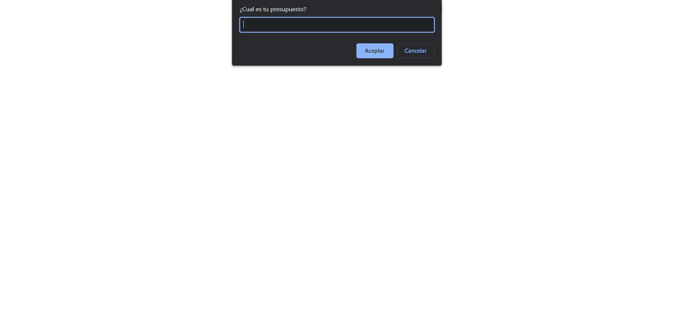
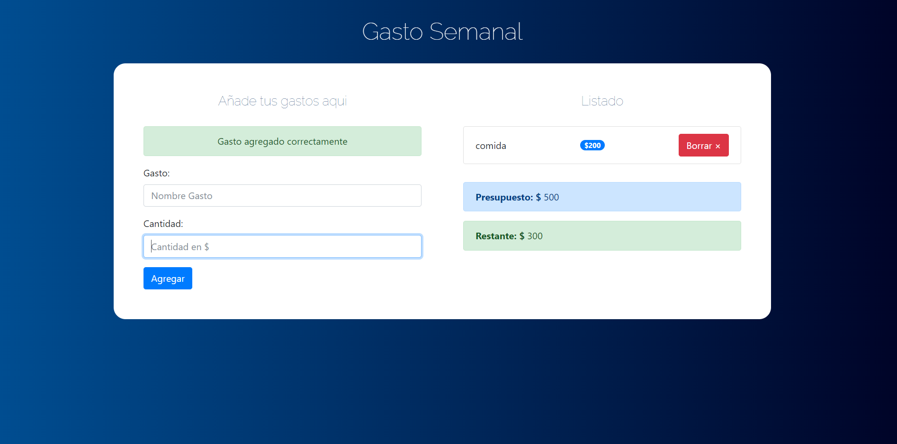
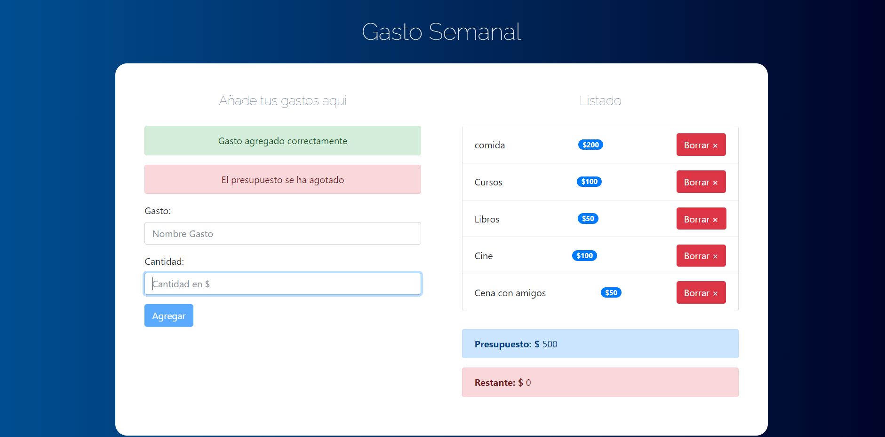

# Gasto Semanal 
Aplicación para llevar un registro del presupuesto y los gastos semanales para una persona. 

## Screenshots:
Tenemos en un principio una ventana prompt que pregunta por el presupuesto.

Podemos agregar todos los gastos que tendremos en una semana.

Cuando nos exedemos del presupuesto la aplicación nos avisa que el presupuesto se agotó y ya no podremos seguir agregando más gastos.

También podremos quitar cuantos gastos sea necesario y asi mismo que presupuesto se ve afectado.
 